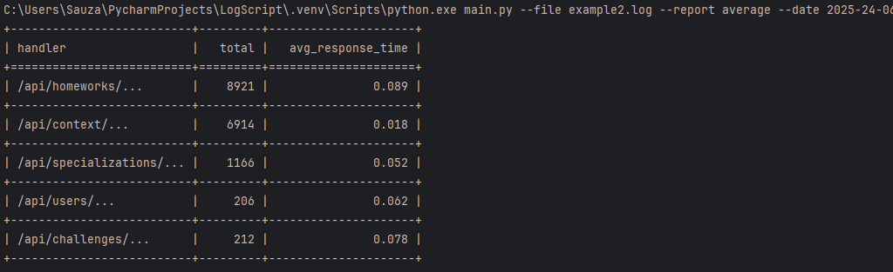
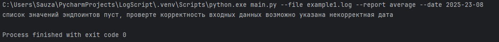

# LogScript
## скрипт для обработки лог-файла

```
Скрипт читает файл и формирует отчет со списком эндпоинтов, 
количеством запросов по каждому эндпоинту и средним временем ответа. 
Пути к файлам и название отчета передаются как параметры, 
например python main.py --file file.log --report average.
```


## примеры комманд:
### Формирует среднее время ответа по каждому эндпоинту
`python main.py --file example1.log --report average`

### Формирует среднее время ответа по каждому эндпоинту по указанной дате
`python main.py --file example1.log --report average --date 2025-22-06`

### тоже самое но другой файл
`python main.py --file example2.log --report average --date 2025-24-06`

### если дата указана неверно 
`python main.py --file example1.log --report average --date 2025-23-08`

### в задании было указано что можно дополнительно сделать так что бы в архитектуру была заложена возможность быстрого добавления новых отчётов. Я реализовал это с помощью абстрактных классов, здесь я просто на примере показал что это можно сделать, то же самое можно реализовать с другими отчетами
`python main.py --file example1.log --user agent --date 2025-22-06`

### другой файл
`python main.py --file example2.log --user agent --date 2025-23-06`


